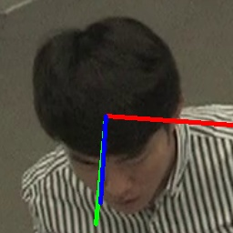
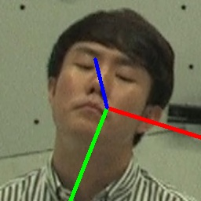
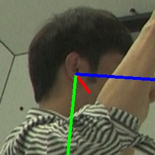
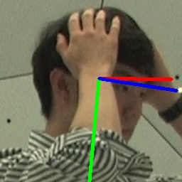
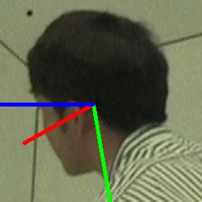
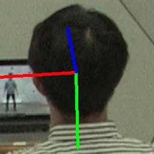
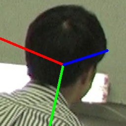

# 6DoFHPE
**Paper titled: Real-time 6DoF Full-Range Markerless Head Pose Estimation**


# Results visualization


<table>
<tr>
<td></td>
<td></td>  
</tr>
</table>


<p align="center">
  Gif: 6DoF-HPE (left side)
</p>
<p align="center">
  and one by one (right side) 
  <a href="https://kagenova.com/blog/tech/2018/07/03/6DOF-motion.html">[source]</a>
</p>

<p align="center">
  Gif: 6DoF-HPE (left side) and one by one (right side) 
  <a href="https://kagenova.com/blog/tech/2018/07/03/6DOF-motion.html">[source]</a>
</p>

* **Video**:  You can see a demo video [here](https://www.youtube.com/watch?v=WWmBZ_2eiaE) and [here](https://www.youtube.com/watch?v=j6g8TqtIwKw&t=9s), which displays a comparison between our work with other works.


<table>
<tr>
<td></td>
<td></td> 
<td></td> 
<td></td> 
<td></td>
<td></td> 
<td></td> 
</tr>
</table>

* **Fig.** Snapshots of 7 different views from one sequence in the CMU Panoptic val-set dataset.


## **Our results**
* **Trained and tested on CMU Panoptic datasets.**


| Method         | Retrain? | Yaw   | Pitch | Roll  | MAE   |
|----------------|----------|-------|-------|-------|-------|
| WHENet         | No       | 37.96 | 22.7  | 16.54 | 25.73 |
| HopeNet        | No       | 20.40 | 17.47 | 13.40 | 17.09 |
| FSA-Net        | No       | 17.52 | 16.31 | 13.02 | 15.62 |
| Img2Pose       | No       | 12.99 | 16.69 | 15.64 | 15.11 |
| DirectMHP      | Yes      | 5.86  | 8.25  | 7.25  | 7.12  |
| DirectMHP      | No       | 5.75  | 8.01  | 6.96  | 6.91  |
| 6DRepNet       | Yes      | 5.20  | 7.22  | 6.00  | 6.14  |
| 6DoF-HPE (ours)  | Yes      | **5.13**  | **6.99**  | **5.77**  | **5.96** |
| WHENet         | No       | 29.87 | 19.88 | 14.66 | 21.47 |
| DirectMHP      | Yes      | 7.38  | 8.56  | 7.47  | 7.80  |
| DirectMHP      | No       | 7.32  | 8.54  | 7.35  | 7.74  |
| 6DRepNet       | Yes      | 5.89  | 7.76  | 6.39  | 6.68  |
| 6DoF-HPE (ours)  | Yes      | **5.83**  | **7.63**  | **6.35**  | **6.60**  |


* **Trained on 300W-LP, and then test on AFLW2000 and BIWI.**

| Method         | Retrain? | AFLW2000 Yaw | AFLW2000 Pitch | AFLW2000 Roll | AFLW2000 MAE | BIWI Yaw | BIWI Pitch | BIWI Roll | BIWI MAE |
|----------------|----------|--------------|----------------|---------------|-------------|----------|------------|-----------|----------|
| HopeNet        | No       | 6.47         | 6.56           | 5.44          | 6.16        | 4.81     | 6.60       | 3.27      | 4.89     |
| FSA-Net        | No       | 4.50         | 6.08           | 4.64          | 5.07        | 4.27     | 4.96       | 2.76      | 4.00     |
| WHENet         | No       | 4.44         | 5.75           | 4.31          | 4.83        | 3.60     | 4.10       | 2.73      | 3.48     |
| LSR                        | No       | 4.26         | 5.27           | 3.89         | 4.47         | 4.29     | **3.09**       | 3.18      | 3.52     |
| DirectMHP      | No       | **2.99**         | 5.35           | 3.77          | 4.04        | 3.57     | 5.47       | 4.02      | 4.35     |
| 6DRepNet       | No       | 3.63         | 4.91           | 3.37          | 3.97        | **3.24**     | 4.48       | **2.68**     | **3.47**     |
| Img2Pose       | No       | 3.43         | 5.03           | **3.28**          | 3.91        | 4.57     | 3.55       | 3.24      | 3.79     |
| DirectMHP      | Yes      | 3.31         | 5.36           | 3.75          | 4.14        | 3.54     | 5.45       | 4.01      | 4.33     |
| 6DRepNet       | Yes      | 3.50         | 4.81           | 3.47          | 3.93        | 3.79     | 4.53       | 2.89      | 3.74     |
| 6DoF-HPE (ours)  | Yes      | 3.56         | **4.74**           | 3.35          | **3.88**       | 3.91     | 4.43       | 2.69      | 3.68     |


# Datasets

* **CMU Panoptic**  from [here](http://domedb.perception.cs.cmu.edu/) for the full range angles.
  
* **300W-LP**, and **AFLW2000** from [here](http://www.cbsr.ia.ac.cn/users/xiangyuzhu/projects/3DDFA/main.htm) for the narrow range angles.

* **BIWI**  from [here](https://icu.ee.ethz.ch/research/datsets.html) for the narrow range angles.

  

## **Run demo codes**

Download the pre-trained RepVGG model '**cmu.pth**'  for the full range angles or '**300W_LP.pth**' for narrow range angles from [here](https://drive.google.com/drive/folders/1Avome4KvNp0Lqh2QwhXO6L5URQjzCjUq) and the pre-trained SSD model '**Head_detection_300x300.pb**' from [here](https://drive.google.com/drive/folders/1Avome4KvNp0Lqh2QwhXO6L5URQjzCjUq) and then save them in their certain directory (please see our code to know their paths).

To run **demo_3DoF.py**. You can run it directly.

But, to run **demo_6DoF.py**. You need to install ROS from [here](https://wiki.ros.org/Distributions).

Maybe you need some time to learn how to install ROS and how it works.

After installing ROS. The roscore can be launched using the roscore executable:

```
roscore
```
Then run an RGB-D camera, for example, if it is  realsense d435i. 

```
roslaunch realsense2_camera rs_camera.launch filters:=pointcloud,colorizer align_depth:=true ordered_pc:=true
```


# Citing

Coming soon!
